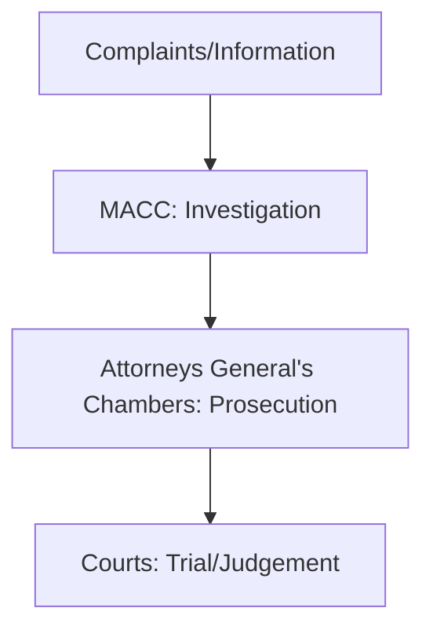

# Malaysian Anti-Corruption Commission (MACC)

* Leading agency in the effort of curbing corruption in Malaysia.

## Departments

1. Special Committee on Corruption
   * Formed through Section 14 MACC Act 2009.
   * Comprise 7 members, representing the ruling party and opposition.
   * Duties
      1. Advise the Prime Minister regarding corruption issues in Malaysia.
      2. Examine and obtain explanation from MACC regarding its activities.
2. Anti-Corruption Advisory Board
   * Formed through Section 13 MACC Act 2009.
   * Duties
     1. To advise MACC regarding policy and strategy.
     2. Examine and endorse MACC's suggestions to enhance its effectiveness.
3. Complaints Committee
   * Formed through Section 15 MACC Act 2009.
   * Duties
     1. To monitor how the MACC handles complaints of misconduct (non-criminal in nature offenses) against its officers.
     2. To identify weaknesses in MACC's standard operating procedures (SOPs) and make appropriate recommendations as it deems it.
4. Consultation and Corruption Prevention Panel
   * Formed administratively.
   * Duties
     1. To advise the MACC in inspection and consultancy activities in order to improve practices, systems, and procedures in public and private sectors.
     2. To advise the MACC in the implementation of anti-corruption education and campaign to increase awareness and to foster support from the public.
5. Operations Review Panel
   * Formed administratively.
   * Duties
     1. To review and scrutinize the MACC's Investigation Papers and decisions made by the Public Prosecutor.
     2. To advise and assist the MACC to improve the effectiveness of its investigation operations.

## Functions

1. Receiving complaints regarding corruption case and abuse of position.
2. Conducting investigation.
3. Providing consultancy and advisory service to improvise systems and procedures which can lead to opportunities and avenue to corruption.
4. Educating and fostering community support in curbing corruption.

## Separation of Power

## How to Prevent Corruption?

* Enforcement
  * Detect corruption offenses.
  * Investigate corruption offenses.
* Prevention
  * Detect the risk of corruption due to weaknesses in practices, systems and procedures.
  * Provide advisory services to strengthen systems and procedures as well as reduce opportunities for corruption.
* Community Education
  * To educate the public against corruption.
  * To enlist and foster public support against corruption.

# The Celebration of International Anti-Corruption Day in Malaysia

* It is 9 December.

# The Malaysian Institute of Integrity

* **Mission:**
  1. Enhance the capacity and competence of the public sector, GLCs and corporates in relation to governance, integrity and anti-corruption.
  2. Provide solutions for issues relating to governance, integrity and anti-corruption.

# The Enforcement Agency Integrity Commission (EAIC)

* It is federal statutory body established through the Enforcement Agency Integrity Commission Act 2019.
* The act was enforced on 1 April 2011.
* **Main Functions:**
  1. Receive complaints of misconduct from the public against enforcement officers or law enforcement agencies.
  2. Investigate and hold a hearing on the complaints received.
* This way, the enforcement activities are constantly monitored and in the event of misconduct, appropriate actions will be recommended.

# National Audit Department

* Perform audits on federal and state government accounts - government agencies, public authorities, and others.
* Audits are conducted to:
  1. Ensure the government's financial management comply with the requirements of laws and regulations.
  2. Reveal factors that do not contribute to efficiency, effectiveness, and economics in relation to national accounting.
  3. Give an opinion on whether the financial statements show true statements and comply with established standards.

## Auditor-General's Report (LKAN)

* Improve integrity and transparency in government financial and procurement.
* It reports weaknesses and non-compliance by public agencies.
* It explains the cause of weaknesses and suggests recommendations for improvement.

# The Public Complaints Bureau (PCB)

* It is a government agency responsible for handling any public complaints against government officials and staff.
* **Main Function:**
  * Resolve complaints efficiently, fairly, and effectively.
  * Provide and improve the facility to make complaints to the public.
  * Detect issues that could be the source of public complaints.
  * Seek public feedback to improve the public service delivery system.