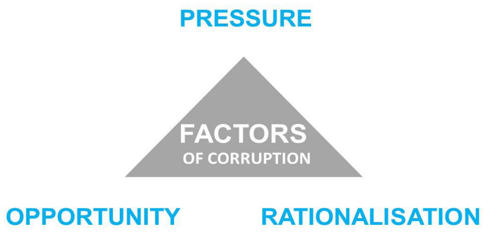
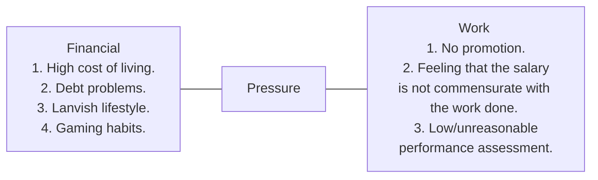

# Why does Corruption Happen

* Power tends to corrupt and absolute power corrupt absolutely.
* Greed in one's self gives opportunity to commit corruption.

# Corruption Equation

* Power + Opportunity - Integrity = Corruption

# Fraud Triangle Theory

## Pressure

## Opportunity

* Weak internal control.
* Opportunity for corruption in system/procedures.
* No monitoring.
* No job separation.
* Too much discretion.

## Rationalization

* "They insist on giving. Just take it. It's not like I asked for it."
* "Even my boss is taking bribes. Why can't I?"
* "It is not his money anyway. He will make claims to the company."
* "If I don't take it, someone else will."

# Identify Symptoms of Corruption

* Sudden change into a lavish lifestyle.
* Failure to explain source of wealth.
* Refusal to be promoted or transferred.
* Suspicious telephone calls.
* Acting like a rich person.
* Sudden resignation.
* Close relationship with company/departments' customers.

# Effects of Corruption

* Corruption affects:
  * National economy and reputation.
    * Global loss due to corruption.
    * Affect Malaysia's reputation in the Corruption Perception Index (CPI).
  * Individual and family.
    * Imprisonment not exceeding 20 years.
    * Fine 5 times the value of gratification or RM 10,000 whichever is higher.
    * Imprisonment caused a public servant lost his/her pension.
    * The name of corruption offenders will be published in Pangkalan Data Pesalah Rasuah for period of 3 years.
  * Property
    * Proceeds from corruption seized and forfeited.
  * Organization
    * Ineffective service.
    * Ineffective systems, procedures and regulations.
    * Injustice in service.
    * Loss of confidence from the public/customers.
    * Tarnishes the organization/departments' image.
  * Security and environment
    * Corruption, mining and smuggling of sand.
    * National entry border invaded.
    * Customs tax leakage.